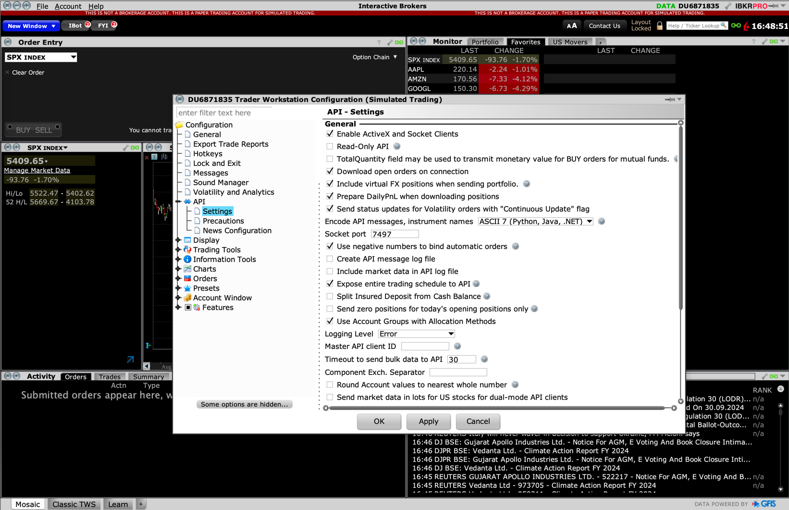

# Algorithmic Trading Bot

This project is an algorithmic trading bot implemented in Python, designed for event-based backtesting. It includes various trading strategies such as long/short strategies, momentum strategies, and mean reversion strategies.

# Work flow 
## 1. Data Fetching:

The historical data is fetched through yfinance library. 
In this project, the sample data are attached in the repo `data` so user can directly use the example data set to have a quick start on the trading bot.

## 2. Event-Based Backtesting 

Although vectorized backtesting is efficient and convenient to implement, it is prone to look-ahead bias. Therefore, a more-realistic approach `Event-based Backtesting`. 
The trading signals are only triggered through the arrival of new data.


## 3. Paper/ Live trading
In this project, the trading bot is connected to Interactive broker. Before connection, either `Trader Workstation (TWS)`
or `IB gateway` is needed to be installed on your side first as an intermediary between your desktop/laptop and the IBKR API service.

If you don't have an account in IB, you can directly use the demo account through providing your email addres.


After signing in, a few configurations needed to be set up first.

In API -> Setting, uncheck the “Read-Only API”.\
In API -> Setting, remember or configure the “Socket port” because you will need it when connecting to this software.\
In API -> Precautions, check the box “Bypass Order Precaution for API Order” to prevent additional errors or warning dialog boxes popped up when you place orders through API.\
If you’re using TWS as your middleman service, you need to check one more box “Enable ActiveX and Socket Client”.


The script `TradeAPI` defines an abstract base class consists of the abstract methods:
1. establish_connection(self)\
Connects to the API and sets up an event listener for order status updates.
Yields control back to the caller while the connection is active.
Disconnects from the API when done. 

2. retrieve_account_info(self)\
Collects account balances and total asset values for each managed account.
Gathers position details for each asset in the portfolio, including quantity, average cost, market value, and unrealized profit/loss.
Retrieves order details, such as order ID, status, timestamp, trade side, and ticker symbol. 

3. submit_order(self, ticker: str, qty: int, limit_price: float = 0)\
Creates a stock contract and qualifies it.
Places a buy or sell market order based on the quantity specified.
Sleeps for 5 seconds to allow time for the order to process.

4. fetch_last_price(self, ticker: str)\
Requests market data for the specified stock.
Polls for the last price, waiting for up to 10 seconds for a valid response. Returns the last price if available, or 0 if not. 


5. is_trading_day_open(self, offset_days=0)\
Retrieves trading hours for the SPY stock.
Checks if today's date is included in the trading hours and returns False if it’s marked as closed. 

6. is_market_open_now(self)\
Retrieves the current trading hours for the SPY stock.
Checks if the current time falls within the market's open hours. 

7. fetch_transaction_history(self)\
Currently not implemented; it could be expanded to fetch historical transaction data.

### Quick Check for IB connection
After following the steps above, user should be able to connect to IB using the template `InteractiveBrokerTradeAPI_test.py` above.
After running the script `InteractiveBrokerTradeAPI_test.py`, the result should look similar to this (if you have already submitted some trades in paper accpount)

```commandline

Current date: 2024-09-07
==============================
Connected to the API
==============================
  account_id available_cash  total_value
0  DU6871835       -8836.84      1956.86
  ticker  quantity  average_cost  market_value  unrealized_pnl  pnl_ratio
0   AAPL       1.0        182.84         220.2           37.36   0.204332
1   TSLA      50.0        168.99       10573.5         2124.00   0.251376
None
==============================
{'20240907': 'CLOSED', '20240908': 'CLOSED', '20240909': '0930-20240909', '20240910': '0930-20240910', '20240911': '0930-20240911', '20240912': '0930-20240912'}
[['20240907:CLOSED'], ['20240908:CLOSED'], ['20240909:0930', '20240909:1600'], ['20240910:0930', '20240910:1600'], ['20240911:0930', '20240911:1600'], ['20240912:0930', '20240912:1600']]
Market Open: False
Market Open Now: False
==============================
79.35
==============================
Disconnected from the API
==============================

```

## 4. Local Database Setup to Store Portfolio History

Interactive Brokers (IB) typically stores historical trading data for up to 30 days for intraday trades. 
Therefore, it is vital to set up a database for retrieving the historic trades and portfolio performance from it 

In this bot, SQLite is chosen due to its simplicity. The class `DatabaseManager` manage trading-related data using the Interactive Brokers API. 
The sqlite_connect method is a context manager that opens a connection to the SQLite database and ensures it is closed afterward.

In the class, the functions are classified into private and public types.

Private Database Functions:
- Table Creation (_sqlite_create_table): Creates tables for transactions and orders if they do not already exist.
- Table Existence Check (_sqlite_is_table_exist): Checks if a specified table exists in the database.
- Data Querying (_sqlite_query_data): Retrieves all data from a specified table and creates the table if it does not exist.
- Record Insertion (_sqlite_insert_record): Inserts a record into a specified table, creating the table first if necessary.

Public Methods:
- Get Transactions (get_transactions): Retrieves transaction records from the database.
- Update Orders in Database (update_orders_in_db): Fetches trades from the broker API and updates the orders table in the database with details like execution time, symbol, order ID, action, quantity, status, commission, and account.
- Update Transactions in Database (update_transactions_in_db): Calculates the portfolio value and SPY close price, then updates the transactions table with this data along with the latest commission.
- Get Commission from Database (get_commission_from_db): Retrieves the total commission from orders in the last specified number of days.

### Quick check for database setup and connection

The sample database `IB_SQLITE_DB.db` is also attached in the repository `database` for your usage and testing.
User can test the code by directly running the script `databaseManager.py`. 
The result should look like this:
```commandline
==============================
Connected to the API
==============================
==============================
Disconnected from the API
==============================
Sqlite connection established
Sqlite connection closed
Sqlite connection established
Sqlite connection closed
   ID                 CREATE_TIME  ...  SPY_CLOSE_PRICE  COMMISSION
0   1                  2024-06-15  ...           300.00        10.0
1   2  2024-06-19 16:23:27.099815  ...             0.00         0.0
2   3  2024-06-19 16:27:16.990054  ...             0.00         0.0
3   4  2024-06-19 16:28:40.432127  ...             0.00         0.0
4   5  2024-06-19 18:38:35.116930  ...             0.00         0.0
5   6  2024-07-25 18:33:04.260423  ...           539.87         0.0
6   7  2024-09-07 18:02:21.460418  ...             0.00         0.0
7   8  2024-09-07 18:08:38.008318  ...             0.00         0.0

[8 rows x 5 columns]
Sqlite connection established
Sqlite connection closed
Database orders updated
==============================
Connected to the API
==============================
No last price available for SPY
==============================
Disconnected from the API
==============================
Sqlite connection established
/Users/doidoifat/Desktop/AlgoTrade/2024AlgoTrade/algoBot/database/databaseManager.py:103: DeprecationWarning: The default datetime adapter is deprecated as of Python 3.12; see the sqlite3 documentation for suggested replacement recipes
  db_conn.execute(sql, value_tuple)
Sqlite connection closed
Sqlite connection established
Sqlite connection closed
Database transactions updated
Sqlite connection established
Sqlite connection closed
Commission from last day: 0
```

# QuickStart
To have a better understanding on the workflow and features of this trading bot, user can first try to run the `SMAsCross_QuickStart` in `event_based_backtest`.


======================================================= \
Final balance   [\$] 47074.72 \
Trades Executed [\#] 68.00\
======================================================= \

Total Return: 370.75% \
Sharpe Ratio: 0.91 \
Calmar Ratio: 0.30 \
Max Drawdown: 55.33% \
Drawdown Duration: 495

## Requirements

numpy==1.9.1
pandas==0.15.2
python-dateutil==2.4.0
pytz==2014.10
six==1.9.0


## Installation

1. Clone the repository:
   ```bash
   git clone https://github.com/phynance/algoBot_EventBacktest_IBConnect_SQLlite.git


## Further development:
Websocket to extract real-time data for higher frequency trading

## References

This project is based on concepts from various sources:

1【How 2】Set Up Trading API Template In Python — Connecting My Trading Strategies To Interactive Brokers]\
2 Python for Algorithmic Trading: From Idea to Cloud Deployment* by YvesYves  Hilpisch. OREILLY, 2021. 
