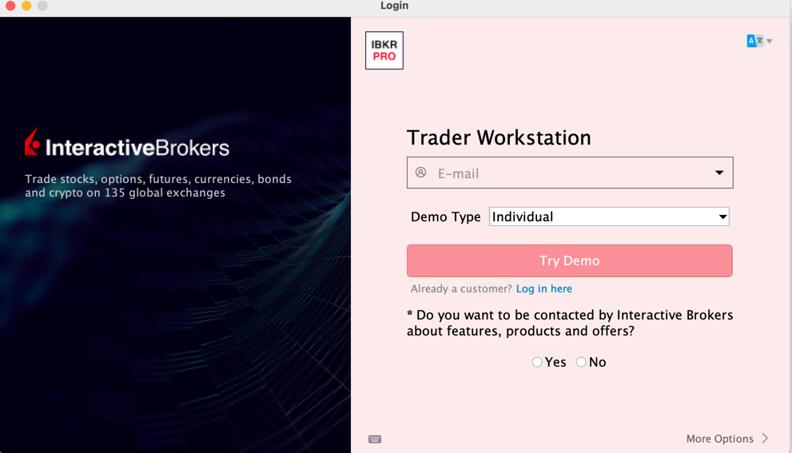
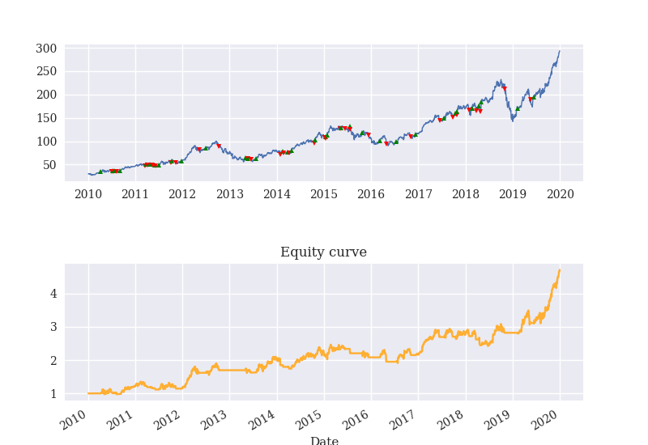

# Algorithmic Trading Bot

This project is an algorithmic trading bot implemented in Python, designed for event-based backtesting. It includes various trading strategies such as long/short strategies, momentum strategies, and mean reversion strategies.

## Work flow 
### 1. Data Fetching:

The historical data is fetched through yfinance library. StockDataFetcher class is initialized with a date range and an optional list of stock symbols. 
In this project, the sample data are attached in the repo `data` so user can directly use the example data set to have a quick start on the trading bot.

### 2. Event-Based Backtesting 

Although vectorized backtesting is efficient and convenient to implement, it is prone to look-ahead bias. Therefore, a more-realistic approach `Event-based Backtesting`. 
The trading signals are only triggered through the arrival of new data.


### 3. Multiple Trading Strategies:
  - **Long/Short Strategy**: Execute trades based on Simple Moving Averages (SMA).
  - **Momentum Strategy**: Trade based on recent price momentum.
  - **Mean Reversion Strategy**: Trade based on the deviation from a moving average.
  - 
Simulate trading strategies using historical data.
**Transaction Cost Management**: Incorporate fixed and variable transaction costs.

### 4. Paper/ Live trading
In this project, the trading bot is connected to Interactive broker. Before connection, either `Trader Workstation (TWS)`
or `IB gateway` is needed to be installed on your side first as an intermediary between your desktop/laptop and the IBKR API service.

If you don't have an account in IB, you can directly use the demo account through providing your email addres.


After signing in, a few configurations needed to be set up first.

In API -> Setting, uncheck the “Read-Only API”.\
In API -> Setting, remember or configure the “Socket port” because you will need it when connecting to this software.\
In API -> Precautions, check the box “Bypass Order Precaution for API Order” to prevent additional errors or warning dialog boxes popped up when you place orders through API.\
If you’re using TWS as your middleman service, you need to check one more box “Enable ActiveX and Socket Client”.

The script `TradeAPI` defines an abstract base class consists of the abstract methods:
- connect(): Method to establish a connection to the trading service.
- get_account_detail(): Method to retrieve account details.
- get_last_price_from_quote(): Method to obtain the last price of a given asset from a quote.
- place_order(): Method to place a trade order.
- is_market_open(): Method to check if the market is open.
- is_market_open_now(): Method to check if the market is currently open.
- get_transactions(): Method to retrieve transaction history.

### 5. Database setup to store portfolio history

- ****: 

- 


## QuickStart
To have a better understanding on the workflow and features of this trading bot, user can first try to run the `SMAsCross_QuickStart` in `event_based_backtest`.



=======================================================\
Final balance   [\$] 47074.72 \
Trades Executed [\#] 68.00\
=======================================================

Total Return: 370.75% \
Sharpe Ratio: 0.91 \
Calmar Ratio: 0.30 \
Max Drawdown: 55.33% \
Drawdown Duration: 495

## Requirements

- Python 3.9
- `pandas`
- `numpy`
- ib_insync

## Installation

1. Clone the repository:
   ```bash
   git clone https://github.com/phynance/algoBot_EventBacktest_IBConnect_SQLlite.git


## Further development:
Websocket to extract real-time data for higher frequency trading